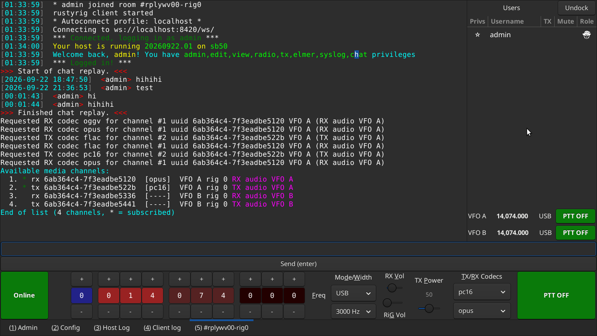
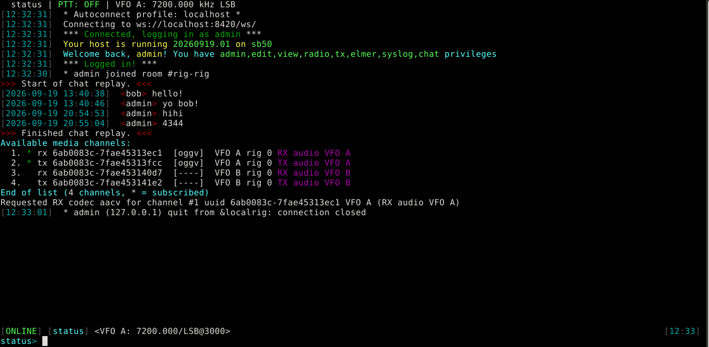
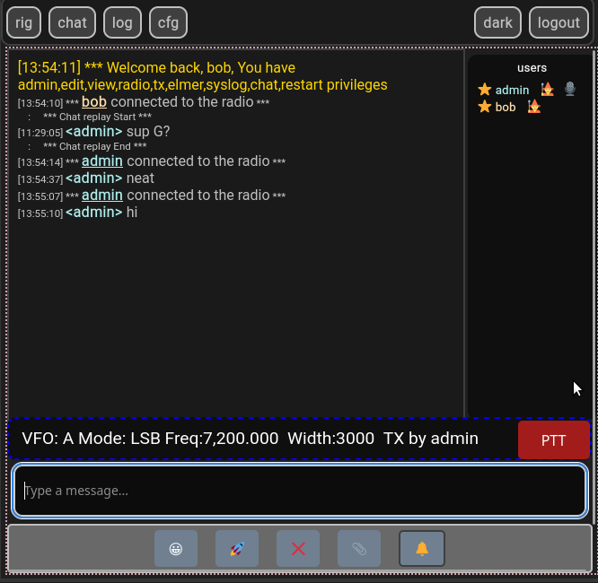

This is the source for rustyrig remote station.

For now it's easiest just to build/run it from this folder, but installing it should probably work.

See QUICKSTART.txt for instructions of use!

Take a look at the deps in install-deps.sh if you need manually install them.
Currently it only supports debian-based systems. Contributions always welcome!

It consists of a few parts:
-	fwdsp/		gstreamer based audio bridge
-	librrprotocol/	RustyRig protocol library, you can make your own client!
-	librustyaxe/	Shared code in many of my projects
-	rrclient/	GTK/TUI client (Use -T to force TUI)
-	rrserver/	backend server
-	www/		WebUI (served by rrserver) - in PripyatAutomations/rustyrig-www repo

You probably will want to run ./install-deps.sh (apt based for now)

Config files go in config/ or ~/.config/

See QUICKSTART.txt for building/running quickstart.

Packaging
---------
Early work to package for arch and debian is present. Feel free to contribute to packaging/testing.

Pipelines
---------
You will want to configure your pipelines in rrserver.cfg and rrclient.cfg

These configurations will use a 4 character ID such as mu08 or pc44 for mulaw 8khz or pcm 44.1khz

RX and TX do not refer to radio role, but rather the direction of the stream itself.

---------

Good luck! - rustyaxe

GTK View:

TUI View:

WebUI View:

